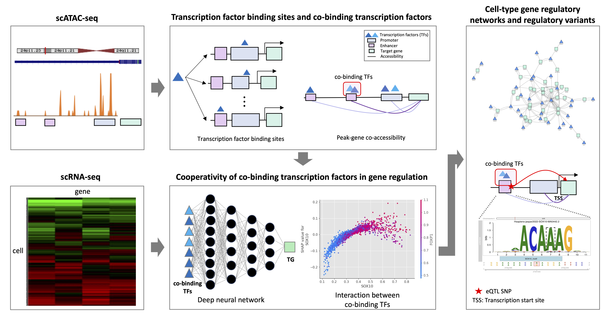

# Single-cell multi-omics analysis reveals cooperative transcription factors for gene regulation in oligodendrocytes

## Oligodendrocytes are the myelinating cells within the central nervous system. Many genes expressed in oligodendrocytes have been associated with brain disorders, and are controlled by complex gene regulatory mechanisms involving several transcription factors (TFs). Individual TFs play important roles, but gene regulation depends on the coordinate action of TF’s that  co-regulate gene expression from regulatory elements in promoters and enhancers. While some instances of co-regulation have been identified, the regulatory mechanisms of cooperative TFs in oligodendrocytes remain largely uncharacterized.
## To address this, we integrated published scRNA-seq and scATAC-seq data to identify the cooperative TFs that co-regulate the expression levels of target genes (TGs) in oligodendrocytes. First, we identified co-binding TF pairs whose binding sites overlapped in oligodendrocyte-specific regulatory regions. Second, we trained a deep learning model to predict the expression level of each TG using the expression levels of co-binding TFs. Third, using the trained models, we computed the TF importance and TF-TF interaction scores for predicting TG expression levels by the Shapley interaction (SI) scores. Finally, we found co-binding TF pairs with high SI scores as ‘cooperative’ TFs for gene regulation in oligodendrocytes.
## We identified 8,101 co-binding TF pairs among 206 TFs for 445 TGs in 643 oligodendrocyte-specific regulatory regions using scATAC-seq peak-gene links. We found that the co-binding TF pairs involving known TF pairs that are important for oligodendrocyte differentiation, such as SOX10-TCF12, SOX10-MYRF, and SOX10-OLIG2, exhibited significantly higher SI scores compared to other co-binding TF pairs (t-test, p-value < 1e-4). Additionally, we found novel TF pairs also have high SI scores, such as RBPJ-TCF12 and ELF2-TCF12, providing potential novel insights into regulatory mechanisms in oligodendrocytes. Furthermore, we identified 153 oligodendrocyte-associated eQTLs that reside in oligodendrocyte-specific regulatory elements that are regulated by cooperative TFs, suggesting potential causal relationships between genetic variants and gene regulatory regions. Some of the identified TF pairs, such as SOX10-OLIG2 and SOX10-NKX2.2, were validated by co-enrichment analysis, using ChIP-seq data from rat peripheral nerve.

